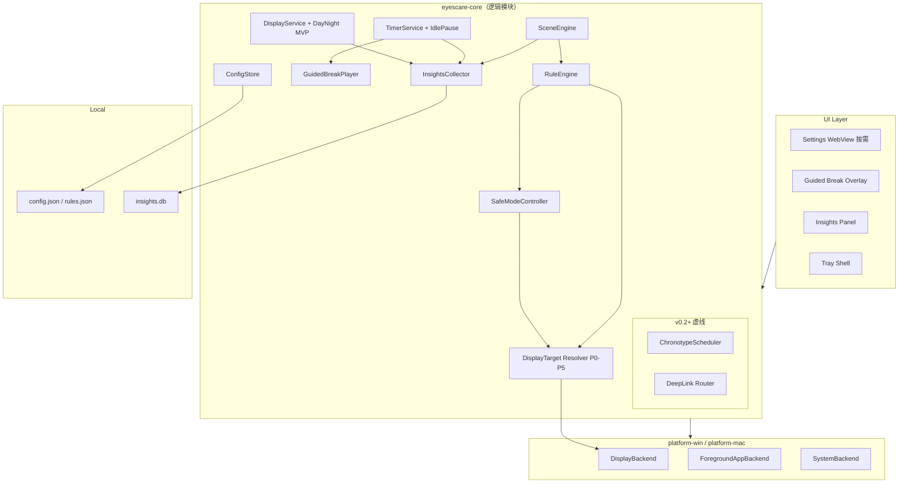
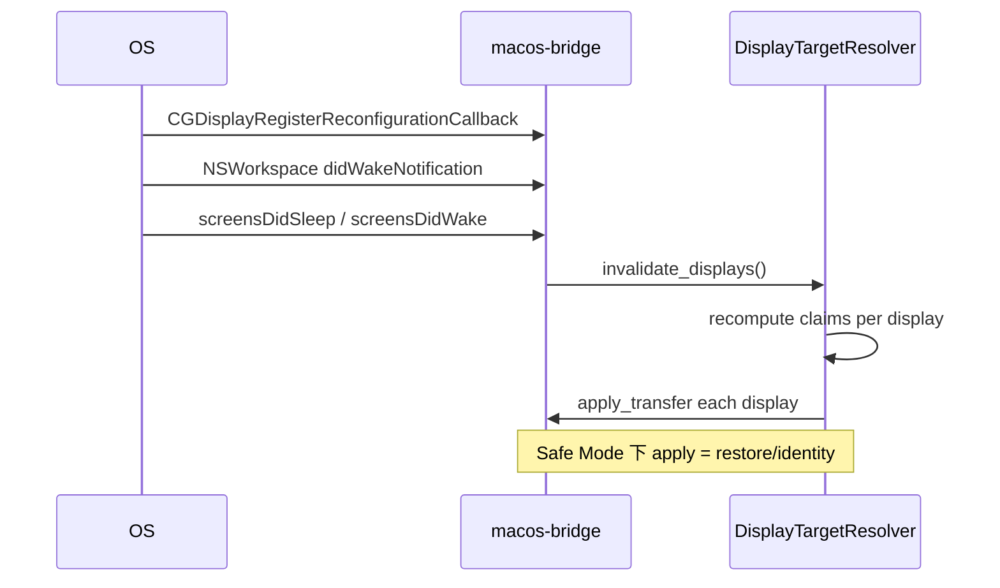
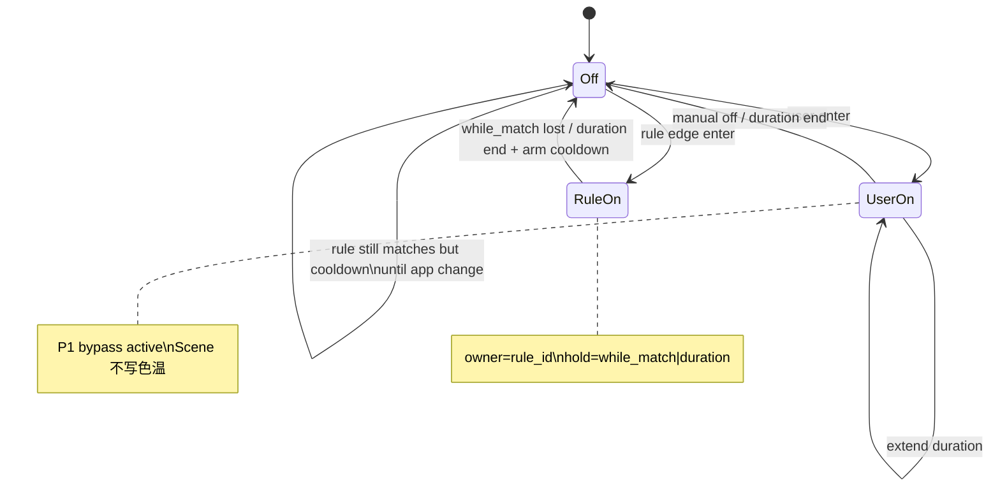

# EyesCare（护眼助手）跨平台技术设计文档

| 字段 | 内容 |
|------|------|
| **文档标题** | EyesCare 跨平台护眼软件 — 系统架构与产品差异化设计 |
| **产品建议名** | **EyesCare**（中文：**护眼助手**；仓库：`eyescare`） |
| **作者** | TBD（架构 / 产品 / 客户端） |
| **日期** | 2026-03-25 |
| **修订** | 2026-03-25 — 差异化强化；**2026-03-25 r2** — 评审修复（Gamma/HDR、Safe Mode 状态机、MVP-A/B、PR 依赖、规则身份模型等） |
| **状态** | Draft（评审修订中 → 可进入实现） |
| **工作区** | `J:\AI项目\eyescare`（当前为空，greenfield） |
| **参考产品** | CareUEyes 等（**Parity 打底**，非品牌/文案抄袭） |
| **目标平台** | Windows 10/11（x64 + arm64 后续）、macOS 12+（Apple Silicon + Intel） |
| **首发策略** | **Win-first dogfood → 双端 MVP-A 对齐**（见 KD16） |
| **叙事原则** | **Parity 打底 + Differentiation 赢用户** |

---

## Overview

数字办公与长时间屏幕使用导致的眼疲劳、蓝光干扰与作息紊乱，是桌面端的刚需场景。CareUEyes、f.lux、Iris 以及系统自带 Night Light / Night Shift 已覆盖「滤蓝光 + 休息提醒」的基础心智，但多数产品仍停留在 **静态滤镜 + 固定计时器**：设计师取色被暖色污染、编码/设计/视频场景需反复手调、休息被通知栏忽略、用户看不到自己的用眼数据、团队无法轻量统一策略。

**EyesCare（护眼助手）** 定位为 **隐私优先、场景智能的跨平台护眼与节律助手**。技术上以 GPU/驱动层色温与亮度（截图尽量不发黄）与低占用托盘常驻为底座；产品上以 **场景智能、设计安全模式、本地眼健康洞察、引导式休息、节律个性化、规则/配置即代码** 形成可感知差异。

本修订在保留差异化支柱的前提下，补齐平台 API 失败模式、Safe Mode ↔ Scene 状态机、MVP-A/B 切分、规则身份模型、PR 依赖图与可落地 schema，使 greenfield 团队可按 **关键路径** 开工。工作区：`J:\AI项目\eyescare`。

---

## 产品差异化策略

### 定位声明（Positioning）

> **EyesCare** 是给「长时间对着屏幕、又在意色准与隐私」的人用的护眼系统：  
> **滤镜会自己懂场景，休息会被认真完成，数据只留在你的电脑上。**

| 竞品 / 参照 | 它们擅长 | 它们的缺口 | EyesCare 怎么赢 |
|-------------|---------|------------|-----------------|
| **CareUEyes** | 功能全（滤镜/计时/聚焦/魔法窗）、双端 | 偏「工具箱堆叠」；场景自动化、本地洞察、配置可编程、设计安全模式不突出 | **Parity 对齐核心体验**，用 Scene + Insights + Guided + Rules **拉开产品叙事** |
| **f.lux** | 色温与昼夜口碑 | 休息/聚焦弱；偏「装上就暖」 | 同等或更好的昼夜 + **可解释的场景与洞察** |
| **Iris** | 功能极深、可玩性高 | UI/学习成本高；部分能力重 | **默认简单 + 高级规则可选** |
| **Win Night Light / macOS Night Shift** | 零安装、系统级 | 不可深度定制、无休息闭环 | **专业可控 + 跨端一致**；冲突时明确互斥引导 |
| **纯番茄钟 App** | 计时专注 | 无显示层护眼 | 计时与显示/节律 **同一产品闭环** |

**一句话竞争策略**：别人卖「滤镜开关」，我们卖「懂你在干什么的护眼节律系统」——且默认不上云。

### Parity vs Differentiators 矩阵

| 能力域 | 类型 | 说明 | 交付切分 |
|--------|------|------|----------|
| 蓝光/色温 + 软件亮度 + 预设 | **Parity** | 基线 | **MVP-A** |
| 昼夜平滑、多屏独立/同步 | **Parity** | 基线 | **MVP-A**（单端可先；双端对齐见 MVP-B） |
| 休息计时（普通 + 20-20-20）、可选锁屏 Overlay | **Parity** | 基线 | **MVP-A** |
| 托盘、开机自启、快捷键、低占用 | **Parity** | 基本盘 | **MVP-A**（壳层最早） |
| 截图尽量不发黄（Gamma 路径） | **Parity+** | 默认强制 | **MVP-A** |
| 空闲检测暂停计时 | **Parity** | 计时器桌面基本能力 | **MVP-A**（称「空闲暂停」，非「智能暂停」） |
| Focus / Magic Window | **Parity（后期）** | 非首发主菜 | v0.3 |
| **设计/取色安全模式** | **Differentiator** | 滤镜旁路、取色友好 | **MVP-A 必达** |
| **场景智能（App 规则）** | **Differentiator** | 进程/bundle → 预设/策略 | **MVP-A 简版** |
| **引导式休息** | **Differentiator** | 短休步骤非空白锁屏 | **MVP-A 简版** |
| **本地洞察基础面板** | **Differentiator** | 今日指标，纯本地 | **MVP-A** |
| 配置 JSON 导入导出 | **Differentiator** | 可编程雏形 | **MVP-A** |
| Deep Link / CLI / Profile 包 | **Differentiator** | 集成与分享 | **MVP-B**（≤2 周快跟） |
| Chronotype / 工作日周末 / 周报 CSV | **Differentiator** | 节律深化 | v0.2 |
| 日历会议联动 | **Differentiator** | 会议中 notify-only | v0.2+ flag |
| Soundscape 扩展库 | **Differentiator** | 产品化声景 | MVP-A 内置 1–2；扩展 v0.2 |
| DDC/CI、opt-in 环境光、插件、团队同步 | **后置** | 权限/兼容风险 | v1.x |

### 五大产品支柱（Pillars）

（支柱不变；交付切分见上表与版本范围。）

#### Pillar 1 — 场景智能（Scene Intelligence）

| 项 | 内容 |
|----|------|
| **用户价值** | 场景自动切预设；设计工具可自动/手动进入滤镜旁路 |
| **MVP-A** | 安全模式（托盘+快捷键）；简单规则（见 §5 身份模型）；全屏策略（默认游戏模板 pause 滤镜 + notify_only 休息） |
| **MVP-B** | 设计模板「前台匹配时自动旁路」默认 **opt-in**（非出厂强开） |
| **技术** | Win/macOS 前台采样；**MVP 不依赖 Accessibility**（见附录 C） |

#### Pillar 2 — 眼健康洞察

| 项 | 内容 |
|----|------|
| **MVP-A** | 今日：活跃时长、滤镜覆盖率、休息遵从、蓝光相对负荷 |
| **存储** | SQLite DDL 见 §8；默认 **app 标识哈希落库**，UI 可解析当前前台显示名（不落明文历史，可配置） |
| **合规** | 固定免责：「仅供自我管理参考，不构成医疗建议」 |

#### Pillar 3 — 引导式休息

| 项 | 内容 |
|----|------|
| **MVP-A** | 短休引导步骤 + 可静默；1–2 个 **自有/CC0** 循环声景（总音频预算 ≤ 1.5 MB 压缩） |
| **交互** | 见 §6.2 MVP Break UX 表（可 ESC/提前结束，非强制） |

#### Pillar 4 — 节律个性化

| 项 | 内容 |
|----|------|
| **MVP-A** | `DayNightScheduler` **内嵌于 DisplayService**（非独立大模块） |
| **v0.2** | Chronotype + 工作日/周末；日历 opt-in |

#### Pillar 5 — 规则与可编程

| 项 | 内容 |
|----|------|
| **MVP-A** | `rules.json` + 设置页 CRUD + 配置整包导出 |
| **MVP-B** | `eyescare://` deep link（运行中+确认）、Profile zip、CLI 雏形 |

### 营销叙事（修正用词）

- ❌ 「硬件级真彩」「硬件校准」  
- ✅ 「**滤镜旁路 / 取色友好模式**」：恢复系统 gamma/transfer，EyesCare 不再施加 LUT  
- ✅ 「写代码时护眼，做设计时旁路滤镜，休息时真的会远眺」  
- ✅ 「数据不出本机的用眼仪表盘」

---

## Background & Motivation

### 当前状态

- 仓库 **为空**；无代码可证伪，实现以本修订 API 契约为准。  
- 差异化空间：**场景、取色冲突、休息完成质量、本地数据、可编程配置**。

### 痛点

| 痛点 | EyesCare 回应 |
|------|----------------|
| 昼夜与蓝光 | DayNight + 后期 Chronotype |
| 取色/截图 | Gamma 默认 + **滤镜旁路（安全模式）** |
| 场景切换累 | SceneEngine + RuleEngine |
| 休息难坚持 | 引导式短休 + 可选强制（v0.2） |
| 无反馈 | 本地洞察 |
| 隐私 | 本地优先 |

### 产品命名

**EyesCare** / 中文 **护眼助手**（主推荐）。

---

## Goals & Non-Goals

### Goals — MVP-A（可发布竖切 / Ship Gate）

**Parity**

1. **至少一平台**完整 Gamma 多屏色温/亮度 + 8 预设 + 昼夜（另一平台可 stub，双端对齐进 MVP-B）。  
2. 截图尽量不发黄：默认 Gamma / CG Transfer；兼容模式明示副作用。  
3. 普通计时 + 20-20-20、休息前 30s 通知、可选引导 Overlay（非强制密码）。  
4. **空闲暂停**计时（离开电脑停止累计工作时间）。  
5. 托盘、开机自启、快捷键；设置窗按需加载 WebView。  
6. 低占用、隐私默认本地。  

**Differentiators（首日可感知）**

7. **设计/取色安全模式**（滤镜旁路）：托盘 + 快捷键 + 倒计时/手动；完整状态机见 §4.5。  
8. **基础场景规则** + 内置模板（设计模板 **默认不自动旁路**，用户可一键启用）。  
9. **引导式短休**（可静默）。  
10. **洞察今日面板** + 本地 SQLite。  
11. 配置 JSON 导入导出。  

### Goals — MVP-B（快跟 ≤2 周，仍属 v0.1 系列）

12. 第二平台 Display 对齐与 CI 双端。  
13. Deep link（`eyescare://`）+ 单实例 + 状态变更确认。  
14. 全屏检测置信度打磨与游戏模板验收矩阵。  
15. Onboarding 60s 完整流程、Night Light/Night Shift 冲突检测 UI。  
16. 诊断包导出打磨。  

### Non-Goals

| 项 | 范围 |
|----|------|
| 医疗宣称 | 禁止 |
| 默认云账号 | 禁止 |
| 克隆竞品品牌文案 | 禁止 |
| 摄像头环境光默认开 | 禁止 |
| 内核锁/反作弊注入 | 禁止 |
| 完整 MDM | 非目标 |
| 日历联动阻塞 MVP-A | 否 |
| Focus/Magic 进 MVP-A | 否 |
| Deep link 阻塞 MVP-A | 否（MVP-B） |

### 版本范围

| 版本 | 内容 |
|------|------|
| **MVP-A（v0.1-ship）** | 上表 Goals MVP-A；**首发 Win dogfood 优先**，macOS 并行但不阻塞 Win 发布 |
| **MVP-B（v0.1.x）** | 双端对齐、deep link、onboarding/冲突检测打磨 |
| **v0.2** | 番茄、强制休息+密码、RuleEngine v2、Profile 包、CLI、Chronotype、周报 CSV、声景扩展；「智能暂停」增强启发式 |
| **v0.3** | Focus Read/Blur、Magic Window、自动暗黑 |
| **v1.0** | 稳定性、无障碍、自动更新、插件事件钩子 |
| **v1.x** | DDC/CI、opt-in 环境光、团队同步实验 |

### Parity 验收清单（最小）

1. 色温连续可调，有效范围内部 **1000–10000K**（UI 可展示，极端值 clamp + 校验）。  
2. 软件亮度 1% 步进。  
3. 预设切换 < 300ms 体感（含短过渡）。  
4. **智能预设** = 纯跟随 DayNight 当前目标（MVP 定义）。  
5. 昼夜过渡默认 60min，可关。  
6. 多屏：Sync 与 PerDisplay 开关可用（在已实现后端的平台上）。  
7. 休息可配置工作/休息时长；预通知 30s。  
8. 休息可 **推迟/跳过** 一次（MVP-A 普通模式；强制模式 v0.2）。  
9. 退出应用后显示恢复系统默认（best-effort + 托盘「恢复显示」）。  
10. 与系统 Night Light/Night Shift 冲突时设置页有说明与「暂停 EyesCare 滤镜」入口。  

### Free / Pro 边界（暂行默认 — KD17）

| 能力 | Free | Pro |
|------|------|-----|
| 色温/亮度/预设/昼夜/多屏 | ✓ | ✓ |
| 安全模式 | ✓ | ✓ |
| 基础规则（≤20 条）+ 内置模板 | ✓ | ✓ |
| 引导短休 + 今日洞察 | ✓ | ✓ |
| 配置导出 | ✓ | ✓ |
| 无限规则 / 时间窗规则 / Profile 包 | — | ✓ |
| 强制休息 + 密码 / 家长 | — | ✓ |
| 周报 CSV / 高级洞察 | — | ✓ |
| CLI / 团队 Profile | — | ✓ |

---

## Proposed Design

### 1. 高层架构

**Tauri 2 + Rust + React**。MVP-A 逻辑模块可先落在 **`eyescare-core` 目录分区**，稳定后再拆 crate（见 KD15 修订）。



### 2. 仓库与模块划分（启动策略）

**阶段 1（MVP-A 速度）— 少 crate：**

```
J:\AI项目\eyescare\
├── apps/desktop/                 # Tauri + React
├── crates/
│   ├── eyescare-core/            # display/timer/scene/rules/safe_mode/insights/guided 目录模块
│   ├── eyescare-platform/        # traits
│   ├── eyescare-platform-win/
│   └── eyescare-platform-mac/
├── assets/guided/ + soundscapes/
├── profiles/templates/
└── scripts/
```

**阶段 2（文件稳定后）**：按 PR 边界抽出 `eyescare-display` / `eyescare-rules` 等；逻辑边界在阶段 1 即用模块文件夹保持。

Cargo features：`platform-win` / `platform-mac`，**DisplayService 平台可选编译**，允许 Win-only dogfood。

### 3. 跨平台技术栈

| 层 | 选型 |
|----|------|
| 框架 | Tauri 2 |
| 核心 | Rust |
| UI | React 18 + TS + Vite + Tailwind |
| 洞察 | SQLite |
| 配置 | JSON + schema_version |
| 音频 | rodio；资源 CC0/自有 |
| Deep link（MVP-B） | `tauri-plugin-deep-link` + single-instance 插件 |
| CI | `windows-latest` 必跑；`macos-latest` 并行不阻塞 Win 发布 |

选型对比（Electron/原生/Flutter/Qt）结论不变：**Tauri**。

---

### 4. 显示层设计

#### 4.1 目标行为

- 色温内部 clamp **[1000, 10000] K**；生成 ramp 后再做 **可读性启发式** 与 **apply 后校验**。  
- 亮度 1% 步进；可软件压暗。  
- 8 预设；**智能 = DayNight 跟随**。  
- 多屏 Sync | PerDisplay。  
- 默认截图友好路径：Gamma / Transfer。  

#### 4.2 算法

`kelvin_to_rgb`（Tanner Helland）→ × brightness → ramp → `apply`；过渡 **合并到 ≤ 12 Hz**（见性能）。  

#### 4.3 Windows 实现与失败模式

##### 主路径：GDI Gamma Ramp

**Per-monitor 算法（MVP 必实现）：**

```text
1. EnumDisplayDevices(NULL, i, &dd, 0) 过滤 DISPLAY_DEVICE_ACTIVE
2. 对每个 DeviceName:
     hdc = CreateDC(TEXT("DISPLAY"), DeviceName, NULL, NULL)
     保存 GetDeviceGammaRamp(hdc) → original_ramps[id]
     SetDeviceGammaRamp(hdc, new_ramp)
     再 GetDeviceGammaRamp 做 readback 校验（见下）
     DeleteDC(hdc)
3. 稳定 ID：DeviceKey / DeviceID 字符串；热插拔后模糊匹配 DeviceString
```

**禁止**依赖单独 `GetDC(NULL)` 作为多屏方案（仅可作单屏 fallback 探测）。

##### HDR 策略（KD18 — 关闭原 OQ）

| 检测 | 手段（尽力） |
|------|----------------|
| HDR 活动 | Win10/11：查询 DXGI 输出颜色空间 / `DISPLAYCONFIG` advanced color 状态；失败则用户设置「我使用 HDR」 |

| 策略 | 默认 |
|------|------|
| **HDR 输出跳过 EyesCare gamma** | **是**（该屏 `pipeline=skipped_hdr`） |
| UI | 横幅：「HDR 开启时系统不保证软件色温；请关闭 HDR 或使用兼容模式（截图可能偏色）」 |
| 兼容模式 | Magnification 矩阵仅 opt-in，且标注截图发黄 |

Microsoft 文档指出 HDR/Auto HDR 下 `SetDeviceGammaRamp` 行为未定义——**不得**假设有效。

##### Apply 后校验与静默失败

```text
apply(ramp):
  ok = SetDeviceGammaRamp(...)
  readback = GetDeviceGammaRamp(...)
  if !ok OR distance(readback, expected) > ε OR perceptual_noop(readback, original):
      mark display.status = ApplyFailed | SilentlyRejected
      不增加 schema 成功计数；触发托盘「显示调节可能未生效」
      可选：降级提示兼容模式
```

`ε`：逐通道平均绝对差相对 65535，默认 > 2% 视为未应用。  
极端暖色：生成阶段即避免「不可读」曲线（抬高最小通道、限制与 identity 的最大偏离），因 OS 会静默拒斥。

##### 重应用触发（Windows）

| 事件 | 动作 |
|------|------|
| `WM_DISPLAYCHANGE` | 重枚举 → Resolver 全量 apply |
| 会话解锁 / `WTS_SESSION_UNLOCK` | 全量 re-apply |
| 电源恢复 | 全量 re-apply |
| 定时 | 可选每 5–10 min 轻量 verify（仅当 status healthy） |
| 其他 App 抢占 | verify 失败 → 提示冲突 |

##### 与系统/第三方冲突矩阵

| 冲突方 | 策略 |
|--------|------|
| Windows Night Light | 设置页检测（注册表/已知 API 尽力）；提示关闭或暂停 EyesCare |
| f.lux / 厂商色彩工具 | 无法可靠检测时：文档 + verify 失败提示 |
| ICC 校准工具 | 退出时 restore 到启动时保存的 ramp，而非假定 sRGB |

##### 回退路径

| 路径 | 截图 | 栈位置 |
|------|------|--------|
| GDI Gamma | 通常不发黄 | 默认 |
| DXGI `SetGammaControl` | 通常不发黄 | **狗食 GDI 失败率高时 spike**（见 Alternatives） |
| Magnification 矩阵 | 常发黄 | 兼容模式，优先级见 §4.6 |
| Overlay 着色 | 发黄 | **禁止用于色温** |

#### 4.4 macOS 实现与生命周期

##### 主路径

- `CGSetDisplayTransferByFormula` 或 `ByTable`  
- 枚举：`CGGetActiveDisplayList`  
- 稳定 ID：`CGDisplayCreateUUIDFromDisplayID`  
- 退出：`CGDisplayRestoreColorSyncSettings()`  

##### 必须持续「占有」transfer 通道（非仅退出时恢复）



| 事件 | 动作 |
|------|------|
| Reconfiguration / 热插拔 | 重枚举 + 全量 apply |
| Sleep / Wake | Wake 后 re-apply（sleep 前可记 claims） |
| Night Shift / True Tone 争用 | 无法稳定私有检测时：用户引导关闭；verify 失败提示 |
| 全屏 Space 变化 | re-verify；失败则 re-apply |

集成测试（手动门禁）：睡眠唤醒、拔线、外接屏，滤镜应在 ≤3s 内恢复意图状态。

#### 4.5 设计/取色安全模式（滤镜旁路）— 完整状态机

**技术定义**：安全模式 = EyesCare **停止施加** 自定义 LUT/transfer，并对各屏执行 **restore 到进入模式前保存的系统/原始 ramp**（或 `CGDisplayRestoreColorSyncSettings` 策略二选一：MVP 采用「恢复进程启动时快照」+ 进入旁路时再次 snapshot）。  
**不是** 硬件校色、不是 ICC 真值、不保证 True Tone/HDR 下的色度计意义。产品文案：**滤镜旁路 / 取色友好**。

##### 两种来源

| 来源 | 枚举 | 进入 | 退出 |
|------|------|------|------|
| 用户 | `UserTriggered` | 托盘/快捷键/（MVP-B deep link） | 手动关；或 `duration` 到期 |
| 规则 | `RuleTriggered` | RuleEngine `action: safe_mode` | 由 `hold` 语义决定 |

##### `hold` 语义（规则 schema 必填）

| hold | 含义 |
|------|------|
| `duration` | 持续 `minutes`（>0）；到期退出，**不**因规则仍匹配而自动重进，直到 **前台 app_id 发生变化** 后规则才可再次触发（防抖键：`last_rule_safe_key`） |
| `while_match` | 保持旁路直到 **匹配条件不再成立**；离开 app 后退出并恢复 Resolver 结果；**禁止**用「恢复后立刻再匹配」制造闪烁（退出帧跳过一次 rule eval，或要求 match 边沿触发） |

##### 状态机



**硬性规则：**

1. **禁止** `restore → 同帧 rule 再 enter` 振荡：`while_match` 用电平保持；`duration` 到期后进入 **cooldown_until_app_change**。  
2. 用户手动进入 **抢占** 规则旁路（`UserTriggered` 覆盖 `RuleTriggered`）；用户退出后，若 `while_match` 仍成立 → **边沿重新武装** 可再次 RuleOn（可选设置「退出后抑制规则 30s」默认开）。  
3. 旁路期间 Scene/Rule **不得** `apply_preset`；可更新「本将命中」调试状态。  
4. 退出旁路：`Resolver.recompute()` 一次，目标来自当前 P2–P5，**不是**简单「旧预设快照」——避免与已变化的 DayNight 脱节；若用户曾 P2 手动锁定则仍尊重锁定。  
5. 优先级：**P1 旁路声明** 由 SafeModeController 持有；规则只是 **进入/退出旁路的触发器**，不与 P1「抢权」循环。

##### 规则 JSON 示例（修正）

```json
{
  "id": "figma-safe",
  "if": {
    "any": [
      { "field": "bundle_id", "op": "equals", "value": "com.figma.Desktop" },
      { "field": "process_name", "op": "equals", "value": "Figma.exe" }
    ]
  },
  "then": {
    "action": "safe_mode",
    "hold": "while_match"
  },
  "enabled_default": false
}
```

定时旁路：

```json
"then": { "action": "safe_mode", "hold": "duration", "minutes": 15 }
```

#### 4.6 DisplayTarget 优先级与并发解析

##### 全局 vs 每屏

- 每个 `DisplayId` 独立计算 `Vec<Claim>`，取最高优先级 **未跳过** 的 claim。  
- Sync 模式：用「主策略源」生成统一参数再广播；PerDisplay：规则可带 `display: focused | all | id`（MVP-A 仅 `all` + focused 前台所在屏可选 v0.2）。  

##### Claim 优先级

| 优先级 | Claim | 说明 |
|--------|-------|------|
| P0 | `EmergencyRestore` / 进程退出 | identity/restore 快照 |
| P1 | `SafeModeBypass` | 滤镜旁路 |
| P2 | `UserManualLock` | 用户拖动并锁定 |
| P3 | `RulePreset` / `RulePolicy` | 规则预设（非 bypass） |
| P4 | `DayNight`（MVP）/ Chronotype(v0.2) | 节律 |
| P5 | `DefaultPreset` | 默认 |
| P3b | `CompatMatrix` | **仅当** 该屏 gamma 持续失败且用户 opt-in 兼容模式；排序上低于成功的 gamma 路径意图，作为管道降级而非色温语义源 |

##### 插值（lerp）取消规则

- 新 claim 优先级 **≥** 当前动画目标优先级 → **立即取消** in-flight lerp，从当前实际 ramp 插向新目标。  
- P1 进入：取消 lerp，**立即** restore（无暖场动画）。  
- P1 退出：从 identity/当前 插向 Resolver 目标（可用 300–800ms）。  
- 同优先级参数微调：合并，12 Hz 限频。  

##### 崩溃 / 强杀恢复

| 机制 | 说明 |
|------|------|
| 正常退出 | `Drop`/Tauri exit hook → restore 全部 |
| panic | `std::panic::set_hook` best-effort restore |
| 强杀 | **无法保证**；文档说明；可选 Win「登录时运行 restore helper」**不做服务驱动** |
| 用户 | 托盘/设置 **恢复显示** 始终可用（P0） |

单元测试：多 claim 叠放、P1 抢占、lerp 取消、Sync 广播。

---

### 5. SceneEngine 与 RuleEngine

#### 5.1 SceneContext（规范身份）

```rust
pub struct SceneContext {
    pub process_name: Option<String>,  // Win: "Code.exe"；mac 可空
    pub path_suffix: Option<String>,   // 可选 "\\Microsoft VS Code\\Code.exe"
    pub bundle_id: Option<String>,     // macOS 主键
    pub app_display_name: String,      // 仅 UI
    pub window_title: Option<String>,  // MVP 可采；匹配默认关
    pub is_fullscreen: bool,
    pub fullscreen_confidence: FullscreenConfidence, // High|Medium|Low|Unknown
    pub fullscreen_kind: FullscreenKind, // Borderless|Exclusive|Maximized|None
    pub display_id: Option<String>,
}
```

**洞察落库**：默认存 `app_key = sha256(process_name|bundle_id)`；明文 display_name **不写历史表**（设置可开「保存应用名用于报告」默认关）。

#### 5.2 匹配模型

| 字段 | 平台 | 说明 |
|------|------|------|
| `process_name` | Win 主 | 大小写不敏感 equals 默认 |
| `bundle_id` | macOS 主 | 大小写敏感 equals（Apple 惯例） |
| `path_suffix` | Win 可选 | suffix 匹配 |
| `app_display_name` | 回退 | contains，易误匹配，模板慎用 |
| `window_title` | 可选 | **需更高权限时 MVP 不做规则条件** |

**运算符** `op`：`equals | prefix | suffix | contains | glob`  

- `glob`：仅 `*` 与 `?`，如 `idea*.exe`  
- 默认 `case_sensitive: false`（bundle_id 强制 true）  

规则：`first_match_wins`（数组序）；设置页可调序。

#### 5.3 全屏检测

##### Windows

| 种类 | 启发 | confidence |
|------|------|------------|
| 最大化 | `GetWindowPlacement` showCmd | Medium |
| 无边框盖住工作区 | 窗 rect ≈ monitor rect 且无 thick frame | High（borderless） |
| 独占全屏 | 前台不在桌面合成路径 / DXGI fullscreen 启发式；不可靠时 | Low→Unknown |
| 跨多屏 | union 虚拟屏 | Medium |

##### macOS

| 种类 | 启发 | confidence |
|------|------|------------|
| 全屏 Space | `NSApplicationPresentationOptions` / 窗 styleMask fullScreen | High |
| 无边框视频 | 边框+rect 启发 | Medium |

##### 产品默认（游戏模板）

```text
filter: pause
breaks: notify_only
```

**独占全屏限制（必写进帮助）：** topmost Overlay **经常无法盖住** exclusive fullscreen；引导休息/强制休息在该场景 **不可依赖**；必须依赖 pause 滤镜 + 通知。Borderless 可测 Overlay。

测试矩阵：borderless / exclusive / 多屏跨屏 / 演示模式。

#### 5.4 全屏策略项

| 项 | 值 | 默认（gaming 模板） |
|----|-----|---------------------|
| filter | keep / pause / gaming_preset | pause |
| breaks | keep / pause / notify_only | notify_only |

---

### 6. 计时器 / 引导休息 / 空闲暂停

#### 6.1 状态机

Working ⇄ Paused（**空闲暂停**：无输入 ≥ 配置阈值，默认 3–5 min）  
PreBreak → GuidedBreak → Working  
Fullscreen `notify_only`：到点只通知，不进 Overlay。

#### 6.2 GuidedBreak MVP UX 表

| 项 | MVP-A（普通/引导） | v0.2 强制 |
|----|-------------------|-----------|
| 结束 | ESC / 按钮「结束休息」 | 仅密码或到时 |
| Alt-Tab | **允许** | 尽量吞掉（非内核） |
| 多屏 | 每屏 overlay；坐标用虚拟屏 | 同左 |
| 音频 | 可选声景；系统静音尊重；**ducking 尽力** | 同左 |
| 减少动态效果 | 遵循 OS reduced motion → 静默步骤 | 同左 |
| 输入 | Overlay 接收点击；不全局 hook | 有限屏蔽 |
| 音频体积 | ≤1.5MB 总预算 | 可扩展 |

窗口层级：

- **Windows**：`WS_EX_TOPMOST` + per-monitor 全屏；非 exclusive 场景。  
- **macOS**：`NSWindow.level = .screenSaver` 或 `CGShieldingWindowLevel()`；多 Space 行为：当前 Space 覆盖，切换 Space 时跟随主屏策略（文档化限制）。  

#### 6.3 平台能力

| 能力 | Windows | macOS |
|------|---------|-------|
| 空闲 | `GetLastInputInfo` | `CGEventSourceSecondsSinceLastEventType` |
| 系统锁屏叠加 | 可选 `LockWorkStation`（v0.2 强制） | 非主路径 |
| 通知 | Tauri notification + 系统权限 | UserNotifications 授权 |

---

### 7. DayNight（MVP）与 Chronotype（v0.2）

- MVP：自定义时刻或粗略日落表；插值 60min；**实现放在 DisplayService 模块内**。  
- v0.2：抽出 ChronotypeScheduler；工作日/周末；日历 opt-in。  

架构图中 Chronotype 标为 **v0.2 虚线**，避免 MVP 过度抽象。

---

### 8. InsightsStore

#### 8.1 SQLite DDL（草案）

```sql
PRAGMA journal_mode=WAL;

CREATE TABLE events (
  id            INTEGER PRIMARY KEY AUTOINCREMENT,
  ts_utc        INTEGER NOT NULL,          -- unix sec
  kind          TEXT NOT NULL,             -- filter_applied, safe_mode_enter, ...
  app_key       TEXT,                      -- sha256 hex or null
  rule_id       TEXT,
  kelvin        REAL,
  brightness    REAL,
  source        TEXT,                      -- user|rule|daynight|safe_bypass|...
  payload_json  TEXT                       -- 小 JSON，禁 PII 明文
);
CREATE INDEX idx_events_ts ON events(ts_utc);
CREATE INDEX idx_events_kind_ts ON events(kind, ts_utc);

CREATE TABLE heartbeats (
  ts_utc     INTEGER PRIMARY KEY,
  active     INTEGER NOT NULL,             -- 0/1 用户有输入会话
  filter_on  INTEGER NOT NULL,             -- 0 若 safe bypass 或 pause
  kelvin     REAL,
  brightness REAL
);

CREATE TABLE daily_rollup (
  day        TEXT PRIMARY KEY,             -- YYYY-MM-DD local
  active_sec INTEGER,
  filter_sec INTEGER,
  safe_sec   INTEGER,
  break_prompted INTEGER,
  break_completed INTEGER,
  blue_load  REAL
);
```

- 保留 90 天；启动时 purge。  
- Rollup：每小时或退出时聚合。  

#### 8.2 指标与 Safe Mode 蓝光策略（KD19）

| 指标 | 定义 |
|------|------|
| 活跃时长 | heartbeats active=1 |
| 滤镜覆盖率 | filter_on=1 时间 / 活跃 |
| 休息遵从 | completed / prompted |
| 蓝光负荷 | 仅 **filter_on=1** 区间计入；**Safe Mode / filter pause 不计入蓝光负荷**（记入 `safe_sec` 供展示「旁路时长」） |

附录 D 公式仅相对分；UI 标注「非光度计量」。

#### 8.3 采样

- Heartbeat 60s。  
- `scene_changed` 事件：**仅 app_key 变化时** emit（禁止 750ms 刷 UI）。  
- Fullscreen notify_only 会话：仍计活跃；滤镜若 pause 则 filter_on=0。  

---

### 9. 配置、Profile、Deep Link

#### 9.1 路径

`%APPDATA%\EyesCare\` / `~/Library/Application Support/EyesCare\`

#### 9.2 Deep Link（MVP-B 默认策略 — KD20）

| 项 | 决策 |
|----|------|
| MVP-A | **不做** 协议注册；托盘/快捷键为主 |
| MVP-B | `tauri-plugin-deep-link` |
| macOS | **编译期** Info.plist URL Types（非 runtime `register_protocol`） |
| Windows | 安装器写注册表 + 插件 |
| 单实例 | **必须** single-instance；第二进程把 URL 转发给第一进程后退出 |
| 安全默认 | **仅当主实例已运行** 处理；状态变更（safe-mode、改预设）→ **通知确认** 或快捷设置「允许自动」默认关 |
| Trait | `DeepLinkBackend::ensure_registered_at_build_or_install()` 文档化平台差异，删除误导性纯 runtime register |

#### 9.3 Profile 包

v0.2；MVP-A 仅整包 JSON 导出。

---

### 10. 聚焦 / 窗口特效

v0.3；MVP 不实现。

---

### 11. UI 信息架构

托盘：滤镜开关、**滤镜旁路**、预设、计时、今日遵从率入口、设置、恢复显示、退出。  

设置 Tab：显示 | 场景与规则 | 计时与引导休息 | 洞察 | 节律（MVP 简单昼夜）| 快捷键 | 通用/隐私 | 关于。  

**Onboarding（MVP-B 完整；MVP-A 最小欢迎页）**：选角色装模板 → 演示旁路 → 开 20-20-20 → 洞察预告。  

---

### 12. 隐私

- 默认无网络。  
- 前台身份本地规则；历史默认哈希。  
- 密码 argon2id（v0.2）。  
- 摄像头永不默认。  

---

### 13. Tauri Capabilities（MVP-A allowlist 原则）

| Capability | 用途 |
|------------|------|
| 通知 | 休息提醒 |
| 全局快捷键 | 旁路/预设 |
| 文件系统（AppData） | 配置/DB |
| Shell 否 | 默认不开 |
| 读取任意路径 | 仅用户选媒体文件对话框 |

具体 `capabilities/*.json` 在 PR-01 落地最小集。

---

## API / Interface Changes

### Platform traits

```rust
pub trait DisplayBackend: Send + Sync {
    fn list_displays(&self) -> Result<Vec<DisplayInfo>>;
    fn apply_ramp(&self, id: &DisplayId, ramp: &Ramp) -> Result<ApplyReport>; // 含 readback
    fn restore(&self, id: &DisplayId) -> Result<()>;
    fn restore_all(&self) -> Result<()>;
    fn rebind_outputs(&self) -> Result<()>; // 热插拔后
    fn detect_hdr_active(&self, id: &DisplayId) -> Result<bool>;
}

pub trait ForegroundAppBackend: Send + Sync {
    fn foreground(&self) -> Result<SceneContext>;
}

pub trait SystemBackend: Send + Sync {
    fn seconds_since_input(&self) -> u64;
    fn set_auto_start(&self, on: bool) -> Result<()>;
    fn on_power_and_display_events(&self, cb: EventCallback) -> Result<Subscription>;
}
```

### 事件（防刷）

| Event | 节流 |
|-------|------|
| `state_changed` | coalesce 100ms |
| `scene_changed` | **仅 app_key 变** |
| `safe_mode_changed` | 立即 |
| `display_apply_failed` | 每屏每分钟最多 1 次 UI |

### 错误模型

```json
{ "code": "GAMMA_REJECTED" | "HDR_SKIPPED" | "DISPLAY_GONE" | "...", "display_id": "...", "message": "..." }
```

---

## Data Model — config / rules schema 草案

### config.json（字段清单节选）

```json
{
  "schema_version": 1,
  "display": {
    "kelvin": 4500,
    "brightness": 0.85,
    "preset": "health",
    "manual_lock": false,
    "multi_monitor": "sync",
    "pipeline": "gamma",
    "hdr_policy": "skip",
    "day_night": {
      "enabled": true,
      "transition_minutes": 60,
      "mode": "custom_times",
      "day_start": "07:00",
      "night_start": "19:30"
    },
    "per_display": {}
  },
  "safe_mode": {
    "active": false,
    "source": null,
    "hold": null,
    "default_minutes": 15,
    "suppress_rule_reenter_sec": 30
  },
  "timer": {
    "profile": "twenty_twenty_twenty",
    "work_sec": 1200,
    "break_sec": 20,
    "idle_pause_sec": 240,
    "guided": true,
    "silent_break": false
  },
  "insights": {
    "store_app_display_names": false,
    "retention_days": 90
  },
  "privacy": { "telemetry": false },
  "flags": { "deep_link": false, "chronotype": false }
}
```

迁移失败：`config.json.bak` + 默认配置 + 日志。

### rules.json

```json
{
  "schema_version": 1,
  "match_policy": "first_match_wins",
  "rules": []
}
```

规则项见 §4.5 / §5.2。

---

## Alternatives Considered

### 产品

1. **纯 Parity 后置差异化** — 拒绝（无换用理由）。  
2. **云端 AI 场景** — 拒绝（隐私/成本）。  
3. **Electron** — 拒绝（内存）。  
4. **Overlay 做色温** — 拒绝（截图）。  

### 技术分叉（可重访）

| 分叉 | 默认 | 重访触发 |
|------|------|----------|
| GDI ramp vs DXGI SetGammaControl | GDI | 狗食 GDI **失败率 > 15%** 目标机型 → spike DXGI |
| GDI vs 安装 ICC | GDI | 需要持久校色且用户接受管理员（基本不做） |
| 场景 750ms 轮询 vs Win EventHook / macOS workspace 通知 | 轮询 MVP | CPU 或延迟投诉 → 事件驱动 |
| SQLite vs JSONL 洞察 | SQLite | 若 MVP 仅今日计数可临时 JSONL，但 DDL 已简 → 保持 SQLite |
| Break WebView vs 原生 overlay | WebView 先 | 内存超标 → 原生长休窗 |
| 纯 Rust bindings vs Swift helper | 纯 Rust/objc2 | CG/AppKit 卡关 → Swift 静态库 |

---

## Security & Privacy

| 主题 | 处理 |
|------|------|
| Deep link（MVP-B） | 单实例；运行中；状态变更确认 |
| Profile | schema 校验 |
| 洞察 PII | 默认 app_key 哈希 |
| 更新签名 | v1.0 |
| 非监控 | 无键盘内容、无隐蔽截屏 |

---

## Observability

- tracing 滚动日志。  
- **诊断与紧急恢复随 DisplayService 同迭代交付**（非发布前最后一项）。  
- 诊断包：脱敏配置、规则、每屏 apply 报告、HDR 状态、最近冲突提示。  

---

## 性能与功耗

| 指标 | 目标 | 测量定义 |
|------|------|----------|
| 空闲内存 | Win ≤ 80MB；mac ≤ 100MB | **仅托盘**，设置/Break/Insights **窗口未创建**；参考机：Win11 + iGPU；Mac M1 16GB |
| 设置打开 | 额外 +50–150MB 可接受 | 关闭后释放 WebView |
| 场景采样 | 常态 CPU 不可感 | 750ms；目标 < 1% 1 分钟平均 |
| Ramp 过渡 | **≤ 12 Hz** 合并 apply | 多屏串行 apply |
| 安装包 | Win ≤ 30MB；mac ≤ 45MB | 含 ≤1.5MB 声景 |

---

## Rollout & 关键路径工期（粗估）

假设 **1–2 名全职** 熟悉 Rust 桌面：

| 阶段 | 内容 | 粗估 |
|------|------|------|
| 关键路径 | 壳+配置+Win Gamma+Resolver+恢复+安全模式 | **3–5 人周** |
| 差异化竖切 | 场景规则+计时+引导休息+洞察 | **3–5 人周** |
| MVP-A 打磨 | 多屏/HDR/冲突/验收 | **2–3 人周** |
| MVP-B | Mac 对齐+deep link+onboarding | **2–4 人周** |
| 风险缓冲 | Gamma 机型坑 | **+2 人周** |

双端同日首发不作为 MVP-A 门禁。

---

## 风险表（增补）

| ID | 风险 | 严重度 | 缓解 |
|----|------|--------|------|
| R1 | Gamma/HDR/静默失败 | 高 | HDR skip、readback、兼容模式 |
| R2 | Night Light 冲突 | 高 | 检测+互斥文案 |
| R3 | 规则误匹配 | 中 | 身份模型+模板审慎+调试「当前命中」 |
| R4 | 旁路忘记关 | 中 | 默认 duration；夜间提醒 |
| R5 | 洞察医疗误解 | 中 | 免责+用词 |
| R6 | 独占全屏吞 Overlay | 高 | 默认 notify_only；帮助说明 |
| R7 | Deep link 滥用 | 中 | MVP-B 确认+单实例 |
| R8 | OS 升级 | 高 | 公开 API；re-apply 生命周期 |
| R9 | 多屏 ID 漂移 | 中 | UUID+模糊匹配 |
| R10 | 签名信任 | 中 | 尽早签名 |
| R11 | MVP 范围膨胀 | 高 | **MVP-A/B 切分** |
| R12 | 强杀无法恢复 gamma | 中 | 诚实说明+托盘恢复 |
| R13 | WebView 内存 | 中 | 按需加载；idle 定义 |
| R14 | 日程：双端 gamma | 高 | Win-first |

---

## 测试策略

### 单元

色温/ramp、readback 距离、Resolver claim、Safe Mode 状态机（含 cooldown）、规则匹配 fixture（VS Code/Cursor/Figma/PS/微信）、洞察聚合与 safe 区间剔除、引导时间轴。

### 集成

mock DisplayBackend；睡眠唤醒 **模拟** rebind+apply；规则边沿触发旁路。

### 实验室矩阵（手动）

| 维度 | 覆盖 |
|------|------|
| GPU | Intel iGPU / NVIDIA / AMD / Apple Silicon |
| HDR | 开/关 |
| 多屏 | 1/2，热插拔 |
| 全屏 | borderless / exclusive |
| OS | Win11、Win10；macOS 13/14/15 |

### 截图不发黄

- 自动化：固定色块窗 → 截图 API → 断言 **overlay 路径未用于 CCT**；gamma 路径允许截图像素≈未滤镜（平台允许范围内）。  
- 人工：Snipping Tool / 系统截图对比。  

### Parity + 差异化门禁

Parity 10 条 + 安全模式进出 + 规则切换 + 引导短休 + 洞察数字 + 恢复显示 + 唤醒 re-apply。

---

## 打包分发

- Win：NSIS/WiX + Authenticode；卸载 restore。  
- macOS：Developer ID + Notarization；MVP-B 写 URL types。  
- 登录项：macOS 优先 `SMAppService`（macOS 13+），旧系统 fallback。  

---

## Key Decisions

| # | 决策 | 选择 | 理由 |
|---|------|------|------|
| KD1 | 产品名 | EyesCare / 护眼助手 | 仓库一致 |
| KD2 | 框架 | Tauri 2 + Rust + React | 低占用+API |
| KD3 | 色温主路径 | GDI / CG Transfer | 截图友好 |
| KD4 | 竞争策略 | Parity + Differentiation | 用户要求 |
| KD5 | MVP 差异化 | 旁路+规则+引导+洞察 | 首日体感 |
| KD6 | 场景识别 | 本地进程/bundle 规则 | 隐私 |
| KD7 | 旁路优先级 | P1，规则仅触发 | 避免振荡 |
| KD8 | 洞察 | 本地 SQLite | 信任 |
| KD9 | 日历 | 非 MVP-A | 权限 |
| KD10 | Focus/Magic | v0.3 | 防堆砌 |
| KD11 | 可编程 | MVP-A 导出；deep link MVP-B | 范围 |
| KD12 | 云 | 非默认 | 隐私 |
| KD13 | 强制休息 | 非内核锁 | 伦理 |
| KD14 | 声景 | 少量 CC0 | 体积 |
| KD15 | 模块 | **先 monorepo 少 crate，逻辑分模块；稳定后拆** | 绿场速度 |
| KD16 | 首发 OS | **Win-first dogfood，Mac 并行不阻塞** | 关闭 OQ3 |
| KD17 | Free/Pro | 表见上；旁路/基础规则/洞察 Free | 关闭 OQ1 暂行 |
| KD18 | HDR | **跳过 gamma + 横幅**；兼容模式 opt-in | 关闭 OQ9 |
| KD19 | 蓝光负荷 | **旁路/暂停滤镜不计入** | 一致口径 |
| KD20 | Deep link | **MVP-B**；运行中+确认+单实例 | 关闭 OQ6 |
| KD21 | 设计模板 | **默认 opt-in 自动旁路，非出厂强开** | 关闭 OQ4 |
| KD22 | 安全模式文案 | **滤镜旁路/取色友好**，禁用「硬件级真彩」 | Issue 8 |
| KD23 | 空闲暂停 | MVP-A 交付；「智能暂停」名留 v0.2 | Issue 23 |

---

## Open Questions（修订后仍开放）

1. **商标**是否最终锁定 EyesCare？  
2. **Pro 价格与授权**（买断 vs 订阅）— 功能边界已有暂行表。  
3. **内置规则模板**完整国内 App 清单（需产品列：微信/飞书/PR/AE…）。  
4. **洞察文案语气**数据向 vs 关怀向。  
5. **家长控制**是否仅 Pro（暂行是）。  
6. **与 Night Light 共存**最终文案 A/B。  
7. ~~首发 OS~~ → KD16  
8. ~~Deep link MVP~~ → KD20  
9. ~~HDR~~ → KD18  
10. ~~设计模板默认~~ → KD21  
11. ~~Free/Pro 功能~~ → KD17  

---

## References

- CareUEyes：https://care-eyes.com/docs/zh-Hans/  
- `SetDeviceGammaRamp`：https://learn.microsoft.com/en-us/windows/win32/api/wingdi/nf-wingdi-setdevicegammaramp （含限制与启发式相关备注）  
- DXGI Gamma：https://learn.microsoft.com/en-us/windows/win32/direct3ddxgi/using-gamma-correction  
- `CGSetDisplayTransferByTable`：https://developer.apple.com/documentation/coregraphics/1454069-cgsetdisplaytransferbytable  
- `CGDisplayRegisterReconfigurationCallback`：Apple Core Graphics Display Services  
- Tanner Helland Kelvin→RGB：https://tannerhelland.com/2012/09/18/convert-temperature-rgb-algorithm-code.html  
- Tauri 2：https://v2.tauri.app/  
- Tauri deep-link plugin：https://v2.tauri.app/plugin/deep-link/  
- Tauri single-instance：https://v2.tauri.app/plugin/single-instance/  

---

## PR Plan

> **原则**：壳层先于旁路 UX；DisplayService **平台 feature 可选**；诊断恢复贴着显示栈；**MVP-A 冻结 = PR-A17**；其后标签 **MVP-B** / **post-MVP**。

### 关键路径工期注记

Display 栈 → Safe Mode → Rules → Break/Insights 为关键路径（约见 Rollout 表）。

---

### PR-A01：仓库脚手架 + capabilities 最小集  
- **影响**：apps/desktop、crates 少仓、CI Win  
- **依赖**：无  

### PR-A02：配置 schema v1 + 迁移 + 导入导出  
- **影响**：core/config  
- **依赖**：A01  

### PR-A03：显示算法（kelvin/ramp/插值限频）  
- **影响**：core/display math  
- **依赖**：A01  

### PR-A04：platform-win DisplayBackend（per-monitor CreateDC、readback、HDR skip、WM_DISPLAYCHANGE rebind）  
- **依赖**：A03  

### PR-A05：platform-mac DisplayBackend（transfer、reconfig/wake re-apply）— **可与 A04 并行，不阻塞 A06-win**  
- **依赖**：A03  

### PR-A06：DisplayService + DayNight + Resolver P0–P5 + **紧急恢复/诊断骨架**  
- **依赖**：A02 + (**A04 或 A05** 至少一侧；`#[cfg(feature)]`)  
- **说明**：托盘「恢复显示」在此可用；panic hook restore  

### PR-A07：Shell — 托盘、自启、快捷键框架、单实例插件  
- **依赖**：A01、A06（恢复菜单项）  
- **说明**：**先于** Safe Mode 完整 UX  

### PR-A08：SafeModeController 状态机 + 托盘/快捷键接入  
- **依赖**：A06、A07  
- **说明**：文案「滤镜旁路」；UserTriggered duration  

### PR-A09：Foreground 采样 + SceneEngine  
- **依赖**：A06  

### PR-A10：RuleEngine + 身份匹配 + 内置模板（设计 opt-in）  
- **依赖**：A08、A09  

### PR-A11：设置 UI — 显示 + 旁路 + 冲突/HDR 横幅  
- **依赖**：A06、A08  

### PR-A12：设置 UI — 场景与规则  
- **依赖**：A10  

### PR-A13：Timer 状态机 + **空闲暂停**  
- **依赖**：A02  

### PR-A14：GuidedBreakPlayer + 短休资源（CC0）  
- **依赖**：A13  

### PR-A15：Break Overlay UI + 通知 + MVP UX 表行为  
- **依赖**：A14、A07  

### PR-A16：Insights SQLite DDL + 采集 + 今日面板 UI  
- **依赖**：A06、A08、A10、A13（事件源齐全）  

### PR-A17：全屏检测 v1 + gaming 模板策略 + Night Light 提示打磨 + **MVP-A 验收清单自动化辅助**  
- **依赖**：A10、A15、A16  
- **说明**：**冻结点 MVP-A freeze** — 可打 ship 标签（允许单 OS）  

### PR-A18：Win 安装包签名流水线（Mac 可后）  
- **依赖**：A17  

---

### MVP-B

### PR-B01：第二平台 Display 对齐 + CI 双端门禁  
- **依赖**：A04 与 A05 均完成、A06  

### PR-B02：Deep link + 协议安全默认 + profile deep link  
- **依赖**：A07、A08  

### PR-B03：Onboarding 60s + 诊断包导出完整  
- **依赖**：A11、A16  

### PR-B04：macOS 公证 dmg + URL types  
- **依赖**：B01、B02  

---

### post-MVP / v0.2+

### PR-P01：番茄钟  
### PR-P02：强制休息 + 密码  
### PR-P03：悬浮窗  
### PR-P04：RuleEngine v2 + Profile 包 + CLI  
### PR-P05：Chronotype + 周报 CSV  
### PR-P06：日历联动 flag  
### PR-P07：Focus Read  
### PR-P08：Focus Blur + Magic  
### PR-P09：自动更新  

（依赖：均在 A17 之后；P04 依赖 B02 更佳。）

---

## 附录 A：预设草案

| 预设 | K | B | 备注 |
|------|---|---|------|
| 健康 | 4500 | 0.85 | 默认 |
| 普通 | 6500 | 1.00 | |
| **智能** | auto | auto | **= DayNight 当前值** |
| 办公 | 5500 | 0.90 | |
| 游戏 | 6500 | 1.00 | 常 pause |
| 夜间 | 3400 | 0.70 | |
| 编辑 | 6500 | 0.95 | |
| 阅读 | 4000 | 0.80 | |

## 附录 B：内置模板（身份修正示例）

| 模板 | 匹配 | 动作 | 默认启用 |
|------|------|------|----------|
| 设计旁路 | `Figma.exe` equals / `com.figma.Desktop` equals；PS 同理 | safe_mode `while_match` | **否（opt-in）** |
| 编码 | `Code.exe` / `Cursor.exe` / `com.microsoft.VSCode` | preset editing | 是 |
| 阅读 | 用户自填 | preset reading | 否 |
| 游戏 | fullscreen confidence≥Medium | filter pause, breaks notify_only | 是 |

JetBrains：`process_name` glob `idea64.exe` 等显式列表，避免无 schema 的 `JetBrains*`。

## 附录 C：权限矩阵（MVP vs 可选）

| 权限 | Win MVP | Mac MVP | 用途 |
|------|---------|---------|------|
| 通知 | 需要 | 需要 | 休息 |
| 自启 | 需要 | Login Item / SMAppService | 常驻 |
| 前台 App 身份 | 常规 API | **NSWorkspace，无需 Accessibility** | 规则 |
| Accessibility | 否 | **否（MVP）** | 标题匹配/部分 FX → v0.2+ |
| Screen Recording | 否 | 否（MVP） | Focus Blur v0.3 |
| 日历 | 否 | 否 | v0.2+ |
| 摄像头 | 否 | 否 | v1.x opt-in |
| 管理员 | 否 | 否 | 默认 |

## 附录 D：蓝光相对负荷

仅 `filter_on` 区间：  
`partial = hours * warmth_factor(kelvin) * brightness_factor`  
`warmth_factor` 随 kelvin 升高而升高（更蓝）。  
**Safe Mode / pause 不计入**。展示为 0–100 相对分。

## 附录 E：规则匹配单元夹具（节选）

| App | process_name | bundle_id | 期望 |
|-----|--------------|-----------|------|
| VS Code | Code.exe | com.microsoft.VSCode | editing 规则 |
| Cursor | Cursor.exe | com.todesktop.* 实测为准 | editing |
| Figma | Figma.exe | com.figma.Desktop | opt-in safe |
| WeChat | WeChat.exe | com.tencent.xinWeChat | **不**误触设计规则 |

---

*文档结束。r2 修订目标：平台可实现性、Safe Mode 无振荡、MVP-A 可冻结、PR 可合并。*
