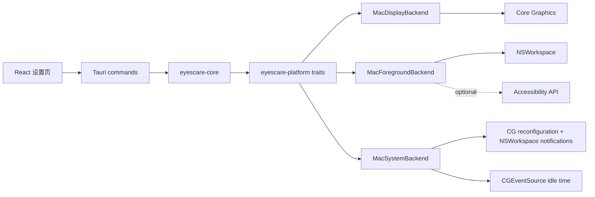

# EyesCare macOS 设计文档

| 字段 | 内容 |
|---|---|
| 状态 | Proposed |
| 日期 | 2026-08-15 |
| 目标版本 | macOS 12 Monterey 及以上 |
| 架构 | Tauri 2 + React + Rust |
| 发布形态 | Developer ID 签名、公证的 Universal `.app` 与 `.dmg` |

## 1. 背景

EyesCare 已具备跨平台 core、平台 trait、Windows 平台实现和 Tauri 桌面壳。`eyescare-platform-mac` 目前只返回 `Unsupported`，桌面端也把所有非 Windows 系统接到 Noop 后端。本设计的目标是在不复制 core 业务逻辑的前提下补齐 macOS 平台能力，并达到现有 Windows 版本的主要功能对齐。

现有可复用边界：

- `eyescare-core`：色温 ramp、显示声明解析、规则、计时、旁路、洞察和配置。
- `eyescare-platform`：`DisplayBackend`、`ForegroundAppBackend`、`SystemBackend`。
- `apps/desktop`：设置页、托盘、快捷键、通知、自启和主循环。

macOS 工作集中在 `crates/eyescare-platform-mac`、桌面端条件编译、macOS 资源和 CI/CD，不重写上述业务模块。

## 2. 目标与非目标

### 目标

- Apple Silicon 和 Intel Mac 上逐屏调节色温与软件亮度。
- 正常退出、panic、滤镜旁路时恢复 EyesCare 启动时保存的逐屏 transfer table。
- 睡眠唤醒、会话恢复和显示拓扑变化后，在 3 秒内重枚举并恢复当前意图。
- 用 bundle ID 驱动场景规则；未授权 Accessibility 时仍可识别前台应用。
- 保持休息计时、空闲暂停、托盘、通知、快捷键、自启和本地洞察可用。
- 生成签名、公证的 Universal `.app` 和 `.dmg`，并与 Windows 产物进入同一 GitHub Release。

### 非目标

- Mac App Store 与 App Sandbox 分发。
- 私有 API、内核扩展、驱动或注入其他进程。
- 控制硬件背光、True Tone、Night Shift 或外接显示器 DDC/CI。
- 承诺 HDR/EDR、Sidecar、DisplayLink 和所有虚拟显示器都接受 transfer table。
- 首个 macOS 版本实现窗口标题规则或强制休息锁屏。

## 3. 关键决策

| 主题 | 决策 | 原因 |
|---|---|---|
| 最低版本 | macOS 12 | 与原设计一致；自启使用 LaunchAgent，不依赖 macOS 13 的 `SMAppService`。 |
| 显示路径 | Core Graphics transfer table | 与现有 `Ramp`/`DisplayBackend` 契约一致，截图通常不包含滤镜。 |
| 恢复策略 | 逐屏恢复进程启动快照 | 不调用全局 ColorSync reset，避免覆盖其他色彩软件的状态。 |
| 稳定显示 ID | `CGDisplayCreateUUIDFromDisplayID`，失败时使用带 `mac:volatile:` 前缀的会话 ID | UUID 可跨重枚举匹配；回退 ID 明确不可跨会话持久化。 |
| HDR/EDR | 只把当前 EDR headroom 大于 1 的屏视为 active；能力值不等于 active | 支持 HDR 但未实际启用时仍允许滤镜。探测失败按非 HDR 处理，并依赖回读判定。 |
| 前台身份 | `NSWorkspace.frontmostApplication` | bundle ID 和显示名不需要 Accessibility 或 Screen Recording。 |
| 全屏增强 | Accessibility opt-in | 拒绝授权时返回 `Unknown`，不阻塞 bundle ID 规则和计时器。 |
| 自启 | 继续使用 `tauri-plugin-autostart` 的 LaunchAgent | 当前 UI 已接通插件；`SystemBackend::set_auto_start` 不是运行路径。 |
| 事件生命周期 | observer/callback 由 `MacSystemBackend` 持有到进程退出 | 当前桌面端立即丢弃 `Subscription`，不能依赖其 Drop 保活。 |
| 分发 | Developer ID、hardened runtime、公证、staple | 满足 Gatekeeper；不发布未签名的正式 DMG。 |

## 4. 总体架构



建议文件边界：

| 文件 | 职责 |
|---|---|
| `crates/eyescare-platform-mac/src/display.rs` | 显示枚举、快照、apply/readback、恢复、HDR/EDR 判断。 |
| `crates/eyescare-platform-mac/src/foreground.rs` | 前台应用身份、可选 AX 全屏信息、显示器映射。 |
| `crates/eyescare-platform-mac/src/system.rs` | 空闲时间、显示重配置、睡眠/唤醒/会话事件。 |
| `crates/eyescare-platform-mac/src/ffi.rs` | Core Graphics/Accessibility 中依赖 crate 未覆盖的最小 FFI。 |
| `crates/eyescare-platform-mac/src/lib.rs` | 仅导出三个后端；非 macOS 目标保留 `Unsupported` stub。 |

平台 crate 使用仓库锁文件中已有的 `core-foundation 0.10.1`、`core-graphics 0.25.0`、`objc2 0.6.4`、`objc2-app-kit 0.3.2` 和 `objc2-foundation 0.3.2`，避免引入第二套 Objective-C 绑定版本。

## 5. 显示后端

### 5.1 状态模型

```rust
struct DisplayState {
    id: DisplayId,
    cg_id: u32,
    original_ramp: Option<Ramp>,
    is_primary: bool,
}

pub struct MacDisplayBackend {
    states: Mutex<Vec<DisplayState>>,
    hdr_skip: AtomicBool,
}
```

`MacDisplayBackend::new()` 立即执行 `rebind_outputs()`。每个新出现的显示器先读取当前 transfer table；读取失败时保留 `None`，恢复时才使用 identity 作为最后兜底。

### 5.2 枚举

1. 用 `CGGetActiveDisplayList` 读取活动显示器。
2. 过滤离线/休眠显示器；镜像输出保留逻辑显示信息，但同一物理 target 只 apply 一次。
3. 用 `CGDisplayCreateUUIDFromDisplayID` 生成 `mac:<uuid>`。
4. 用 `CGDisplayIsMain`、像素宽高和当前 display mode 填充 `DisplayInfo`。
5. 通过 `NSScreenNumber` 将 `CGDirectDisplayID` 映射到 `NSScreen`，读取当前而非 potential EDR headroom。

`rebind_outputs()` 按稳定 ID 迁移 `original_ramp`，新屏抓取新快照，移除已离线的 session state。重绑定只改变平台状态；上层 `DisplayService::rebind_and_refresh()` 负责刷新 cache 和重新计算 claims。

### 5.3 Apply 与回读

使用 256 项 RGB table，避免 formula 对非线性 ramp 的表达损失：

1. 若 `hdr_skip=true` 且当前屏 EDR active，返回 `HdrSkipped`。
2. 调用 `CGGetDisplayTransferByTable` 读取 apply 前状态；尚无快照时保存。
3. 将 `u16` 归一化为 `CGGammaValue`，调用 `CGSetDisplayTransferByTable`。
4. 再次读取 table，并重采样到 256 项。
5. 沿用 Windows 的 2% 平均绝对差阈值。写入失败、目标回读偏差超阈值，或目标非 identity 但回读几乎等于原状态时返回 `Rejected`。

macOS 可能返回少于 256 个样本。读取路径必须用线性插值归一化到 `Ramp`；写入固定为 256 项。零样本、通道长度不一致和非有限浮点数视为 `Error::GammaRejected`。

### 5.4 恢复

- `restore(id)`：优先写回该屏的 `original_ramp`；无快照时写 identity。
- `restore_all()`：逐屏 best-effort 恢复，尝试所有显示器后返回首个错误，不能因一屏失败跳过后续屏。
- 不在正常路径调用 `CGDisplayRestoreColorSyncSettings()`；它只能作为显式诊断/应急工具的后续候选，且不进入 v0.1 macOS 版本。

### 5.5 生命周期与冲突

Core Graphics reconfiguration callback 可能连发。`MacSystemBackend` 在 250ms 窗口内合并为一次 `DisplayChanged`。收到 `PowerResumed`、`SessionUnlocked` 或 `DisplayChanged` 后，现有桌面逻辑执行重绑定并重应用。

Night Shift、True Tone、ColorSync 工具和 DisplayLink 可能覆盖 transfer table。首版不轮询抢占通道；只在用户动作、规则变化、昼夜变化、显示事件和唤醒时 apply。回读失败会进入现有 rejected 状态，UI 后续可显示冲突提示。

## 6. 前台应用与权限

### 6.1 零权限基础路径

每次采样在 autorelease pool 中读取：

- `NSWorkspace.sharedWorkspace.frontmostApplication`
- `bundleIdentifier` -> `SceneContext.bundle_id`
- `localizedName` -> `app_display_name`
- `executableURL.lastPathComponent` -> `process_name`，仅用于诊断/兼容

前台应用不可用（登录窗口、桌面切换等）时返回空身份和 `FullscreenConfidence::Unknown`，不返回 `Unsupported`，避免主循环刷错误日志。

### 6.2 Accessibility 增强

Accessibility 仅用于读取焦点窗口的 `AXFullScreen`、位置和尺寸：

- 已授权且 `AXFullScreen=true`：`is_fullscreen=true`、`High`、`Borderless`。
- 已授权但只有窗口矩形覆盖屏幕：`Medium`、`Borderless`；由于 core 只把 High 用于全屏规则，不会误触发游戏模板。
- 未授权、属性缺失或应用拒绝 AX：`is_fullscreen=false`、`Unknown`、`None`。

设置页提供“增强全屏识别”开关和“打开系统设置”动作。只有用户主动开启时调用 `AXIsProcessTrustedWithOptions(prompt=true)`。不申请 Screen Recording，也不采集窗口标题。

### 6.3 权限矩阵

| 功能 | Accessibility | Screen Recording | 其他 |
|---|---:|---:|---|
| 色温/亮度 | 否 | 否 | 无 |
| bundle ID 规则 | 否 | 否 | 无 |
| 全局快捷键 | 否 | 否 | 由 Tauri 插件注册 |
| 通知 | 否 | 否 | 首次通知由系统询问 |
| 空闲暂停 | 否 | 否 | 使用系统 idle API |
| 高置信度全屏规则 | 可选 | 否 | Accessibility |

## 7. 系统后端

`MacSystemBackend` 提供：

- `seconds_since_input()`：`CGEventSourceSecondsSinceLastEventType`，错误或非有限值返回 0。
- `on_power_and_display_events()`：注册 Core Graphics display callback；监听 workspace sleep、wake、session resign/active 通知。
- `set_auto_start()`：返回 `Unsupported` 并记录这是非运行路径；产品自启由 Tauri 插件负责。

observer token、callback 和闭包都存放在 backend 内部。`Drop` 时注销 Core Graphics callback 和通知 observer。桌面进程只创建一个 `MacSystemBackend`，禁止重复订阅生成多份 observer。

事件映射：

| macOS 事件 | `SystemEvent` | 上层动作 |
|---|---|---|
| display add/remove/move/mode change | `DisplayChanged` | rebind、刷新 cache、重应用 |
| `NSWorkspaceDidWake` | `PowerResumed` | rebind、重应用 |
| session became active | `SessionUnlocked` | 重应用 |
| `NSWorkspaceWillSleep` | `SystemSleep` | 记录；退出恢复由 terminate 路径负责 |

## 8. Tauri 壳集成

`apps/desktop/src-tauri/Cargo.toml` 新增 macOS target dependency。setup 中使用三个 macOS 后端，只有初始化失败时才退回 Noop，并保留清晰日志。

```rust
#[cfg(target_os = "macos")]
let display_backend: Arc<dyn DisplayBackend> =
    Arc::new(eyescare_platform_mac::MacDisplayBackend::new()?);
```

macOS 特有行为：

- 设置 `ActivationPolicy::Accessory`，常驻菜单栏但不显示 Dock 图标。
- 菜单栏图标使用黑白 template image，支持浅色/深色菜单栏。
- 点击菜单栏图标打开菜单；“设置”负责激活应用并聚焦窗口。
- `RunEvent::Exit`、托盘退出和 panic 继续走 `restore_all()`。
- 保留 `Ctrl+Alt` 默认快捷键以兼容现有 schema；设置页可改为 Command 组合键。后续 schema 迁移再提供平台默认值。

状态 IPC 增加当前场景的 `bundle_id` 和全屏置信度，规则新增表单允许选择“进程名”或“Bundle ID”。macOS 默认选择 Bundle ID，Windows 默认选择进程名。

## 9. 配置与数据兼容

- 不提升 `AppConfig.schema_version`：显示和计时配置跨平台可复用。
- `display.per_display` 以 `DisplayId` 为键；Windows 和 macOS ID 带不同前缀，不会互相覆盖。
- 规则文件已经支持 `bundle_id`，无需迁移。
- 导入 Windows 配置到 macOS 时，进程名规则保留但不会命中；内置模板中已有 bundle ID 的规则可直接工作。
- 数据目录继续使用 Tauri `app_data_dir/com.eyescare.app`，SQLite schema 不变。

## 10. 构建与发布

### 10.1 Bundle

- `tauri.conf.json` 的 bundle target 改为跨平台配置，Windows job 显式传 `--bundles nsis`，macOS job传 `--bundles app,dmg`。
- 增加 `.icns` 应用图标和菜单栏 template 图标。
- 设置 `MACOSX_DEPLOYMENT_TARGET=12.0`。
- GitHub Actions 安装 `aarch64-apple-darwin` 与 `x86_64-apple-darwin`，用 `--target universal-apple-darwin` 构建。

### 10.2 签名与公证

正式 tag 构建必须具备以下 GitHub Secrets：

- `APPLE_CERTIFICATE`：Developer ID Application 证书的 base64 PKCS#12。
- `APPLE_CERTIFICATE_PASSWORD`。
- `APPLE_SIGNING_IDENTITY`。
- `APPLE_ID`、`APPLE_PASSWORD`（app-specific password）、`APPLE_TEAM_ID`。

CI 通过 Tauri 的 Apple 环境变量完成签名、公证和 staple。缺少任一 secret 时正式 release job 失败，不降级发布未签名 DMG。Pull Request CI 只构建未签名 `.app` 或执行 `cargo check`。

Windows、macOS 构建 job 只上传 artifacts；单独的 publish job 在两边都成功后下载全部产物并创建一次 GitHub Release，避免并发创建或半成品发布。

## 11. 测试与验收

### 自动化

- 纯函数：table 归一化、浮点/u16 转换、readback 分类、稳定 ID 回退、事件去抖。
- mock display API：枚举、首次快照、拒绝检测、逐屏恢复、热插拔快照迁移、一屏恢复失败不阻塞其他屏。
- foreground：无前台 app、bundle ID、未授权 AX、AX fullscreen。
- system：idle 的 NaN/负值/上限处理和事件映射。
- 桌面编译：macOS target 不再引用 Noop；Windows target 不受影响。
- 前端构建：Bundle ID 新增规则和状态字段通过 TypeScript 检查。

### 真机门禁

| 场景 | 预期 |
|---|---|
| Apple Silicon 内屏 | 调节、旁路、退出恢复 |
| Intel Mac | 同上 |
| 一台外接屏 | 两屏独立枚举与恢复 |
| 拔插/改变分辨率 | 3 秒内恢复当前意图 |
| 睡眠/唤醒 | 3 秒内恢复当前意图 |
| Night Shift/True Tone 开关 | 不崩溃；回读失败可诊断 |
| Accessibility 拒绝 | bundle ID 规则仍工作，全屏显示 Unknown |
| Accessibility 允许 | 原生全屏 Space 为 High |
| HDR/EDR 屏 | active 时默认跳过，关闭/非 active 时允许 apply |
| 签名 DMG | `spctl --assess`、`codesign --verify` 和 `stapler validate` 通过 |

## 12. 可观测性与失败策略

平台日志只记录 display ID、OSStatus、apply outcome 和权限状态，不记录窗口标题或完整应用路径。错误遵循以下策略：

- 单屏 apply/rebind 失败：不中止计时器和其他显示器。
- display 初始化失败：桌面端回退 Noop，设置页显示“显示后端不可用”。
- foreground 失败：返回空 SceneContext，不重复弹权限请求。
- 可选权限拒绝：功能降级，不影响启动。
- 恢复失败：尝试所有屏并记录；退出流程不能无限等待。

## 13. 风险

| 风险 | 影响 | 缓解 |
|---|---|---|
| Apple Silicon/OS 更新拒绝 transfer table | 滤镜不生效 | 回读、明确失败状态、实验室矩阵；不伪报 Applied。 |
| Night Shift/True Tone 抢占 | 色温漂移 | 生命周期重应用、冲突提示、旁路。 |
| HDR/EDR 探测语义变化 | 误跳过或误应用 | 区分 current/potential headroom；用户 Force；回读。 |
| AX 权限降低转化 | 全屏规则不完整 | 基础身份零权限；只在用户开启增强功能时提示。 |
| 全局 reset 破坏其他颜色工具 | 用户色彩状态丢失 | 只恢复逐屏启动快照。 |
| 签名/公证配置错误 | Gatekeeper 拒绝 | tag workflow fail closed；发布前运行三条系统验证命令。 |
| Universal 构建依赖原生库缺 slice | 构建失败 | 当前 native 依赖逐项在 CI 验证两种 target，再合并 universal。 |

## 14. 交付顺序

1. 显示 backend 与自动化测试。
2. 前台身份、可选 AX 全屏与系统事件。
3. Tauri 接入、菜单栏行为和规则 UI。
4. macOS CI、Universal bundle、签名与公证。
5. 两类 Mac + 外接屏真机验收后发布 beta。

完整的文件级实施步骤见 `docs/superpowers/plans/2026-08-15-macos-support.md`。
